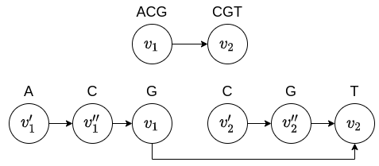
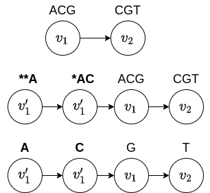

# Algoritmo de Rautiainen and Marschall

## Dado um grafo de sequências G e uma sequência s, o algoritmo devolve um percurso p em G tal que a sequência induzida por p é a mais parecida com s


## Grafo de De Bruijn

## Grafo de sequências simples

## Trasformando um grafo de De Bruijn em um grafo de sequências simples

### Ideia 1 (função dbgToSequenceGraph_1)
A ideia consiste em, dado um grafo de De Bruijn, de ordem k, Gk. Vamos pegar cada kmer e transformar em k vértices e inserir em um grafo de sequências simples com as devidas adjacências.



### Ideia 2 (função dbgToSequenceGraph_2)
A ideia consiste em, dado um grafo de De Bruijn, de ordem k, Gk. 
Vamos pegar cada kmer que possui grau de entrada 0 e inserir k-1 kmers no grafo de De Bruijn como mostra o segundo grafo da imagem e depois converter para um grafo de sequências simples considerando o k-ésimo caractere de cada kmer.



### dbgToSequenceGraph_1 vs dbgToSequenceGraph_2
A principal vantagem entre as duas transformações está no tamanho grafo de sequências simples gerado. Considerando um grafo de De Bruijn, de ordem k, Gk com m kmers e com todos os kmers de comprimento n. A transformação 1 do grafo G_k no grafo de sequência simples com O(m * n * k - m * k^2 + m * k) vértices para 2 <= k <= n. A transformação 2 gera um grafo de sequências simples com O(m * n) vértices.

## Mapeando uma sequência s no grafo de sequência simples

## Começando

### Pré-requisitos

* GCC (>= 4.0)
* MPI

## Rautiainen and Marschall

O arquivo do marschall.cpp possui três parâmetros de entrada: um grafo de De Bruijn (um arquivo listando sequências), uma sequência e um inteiro k >= 0.

### Entrada

Um arquivo txt com as sequências do Grafo de De Bruijn, uma sequência s e um inteiro positivo k.

**Exemplo de grafo de De Bruijn:**

```
Sequence 1
Sequence 2
Sequence 3
```
A sequência s representa a sequência mapeada no grafo de De Bruijn e o inteiro _k_ representa o comprimento do _k_-mer.

### Saída
A sequência induzida pelo caminho no grafo de De Bruijn tal que a diferença entre s e a sequência induzida é a menor possível.

### Execução
```
./marschall -s sequence -g graph.txt -k 3
```

## Resultados
### Coluna 1: inteiro k (comprimento do kmer)
### Coluna 2: quantidade kmers no grafo de De Bruijn Gk
### dbgToSequenceGraph_1
#### Coluna 3:quantidade de vértices do grafo de sequência simples H
### dbgToSequenceGraph_1
#### Coluna 4: quantidade de kmers do grafo de De Bruijn G'k
#### Coluna 5: qantidade de vértices do grafo de sequência simples H'

| k  | Gk  |  H   | G'k | H'  |
|----|-----|------|-----|-----|
| 3  | 36  | 108  | 36  | 36  |
| 4  | 61  | 244  | 61  | 61  |
| 5  | 82  | 410  | 86  | 86  |
| 10 | 122 | 1220 | 139 | 139 |
| 20 | 102 | 2040 | 139 | 139 |
| 30 | 82  | 2460 | 139 | 139 |
| 40 | 62  | 2480 | 139 | 139 |
| 50 | 42  | 2100 | 139 | 139 |
| 60 | 22  | 1320 | 139 | 139 |
| 70 | 2   | 140  | 139 | 139 |   

## Conclusão
Como podemos observar, a nossa transformação resulta em um grafo bem menor do que o original;
